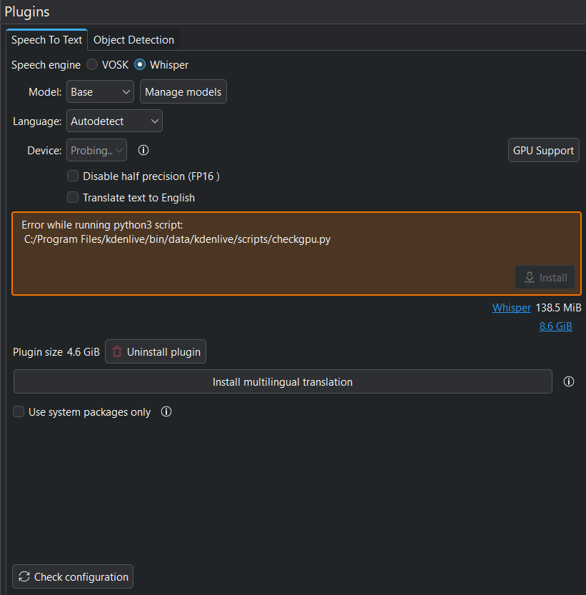

# Diário de Bordo – Karolina Vieira

**Disciplina:** Gestão da Configuração e Evolução de Software (GCES)  
**Equipe:** GCES 2026.1 – Kdenlive  
**Comunidade/Projeto de Software Livre:** [Kdenlive](https://invent.kde.org/multimedia/kdenlive)  
**Matrícula:** 202045820  
**GitHub:** [@karolina](https://github.com/karolina91)  
**KDE Invent:** [@karovieira](https://invent.kde.org/karovieira)

---

## 1. Resumo da Sprint

Nesta sprint, tive como objetivo selecionar uma das issues disponíveis no KDE Invent. O critério adotado para a escolha foi baseado no nível de dificuldade e na priorização das issues mais recentes. Dessa forma, a issue selecionada foi a [#2183 Speech-to-text, error after changing the Python path](https://invent.kde.org/multimedia/kdenlive/-/work_items/2183) 

---

## 1.2 Sobre a issue 

O principal problema dessa issue é a detecção do caminho do Python no Windows. Quando o usuário altera a instalação ou o caminho do Python, o recurso de speech-to-text deixa de funcionar, sendo necessário clicar manualmente em “Check configuration” para que o Kdenlive detecte novamente o interpretador Python.

*Figura 2: Issue 2183*
---

## 3. Maiores Avanços

Com essa issue aprendi mais sobre como o Kdenlive gerencia dependências externas, principalmente a detecção do Python no Windows. Também aprendi sobre validação de caminhos de executáveis.

---

## 4. Maiores Dificuldades

Minha maior dificuldade foi localizar no código onde o problema realmente ocorria e entender como a detecção do Python era implementada no Kdenlive. Depois disso, foi necessário compreender a lógica de validação dos caminhos salvos e definir uma forma adequada de realizar a redetecção automática do executável sem afetar outras configurações do sistema.
---

## 6. Plano Pessoal para a Próxima Sprint

Meu plano pessoal é finalizar e realizar o commit dessa implementação, testar o comportamento em diferentes cenários no Windows e, em seguida, abrir o merge request para revisão, buscando validar se a solução realmente resolve o problema relatado na issue.