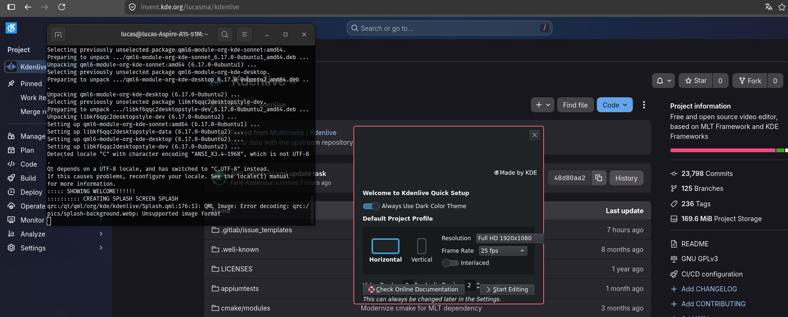
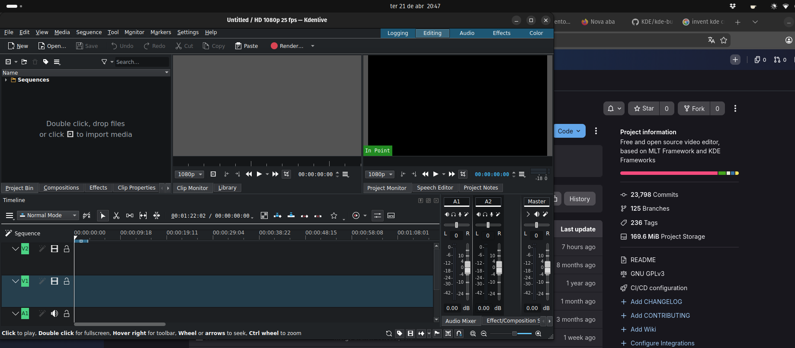
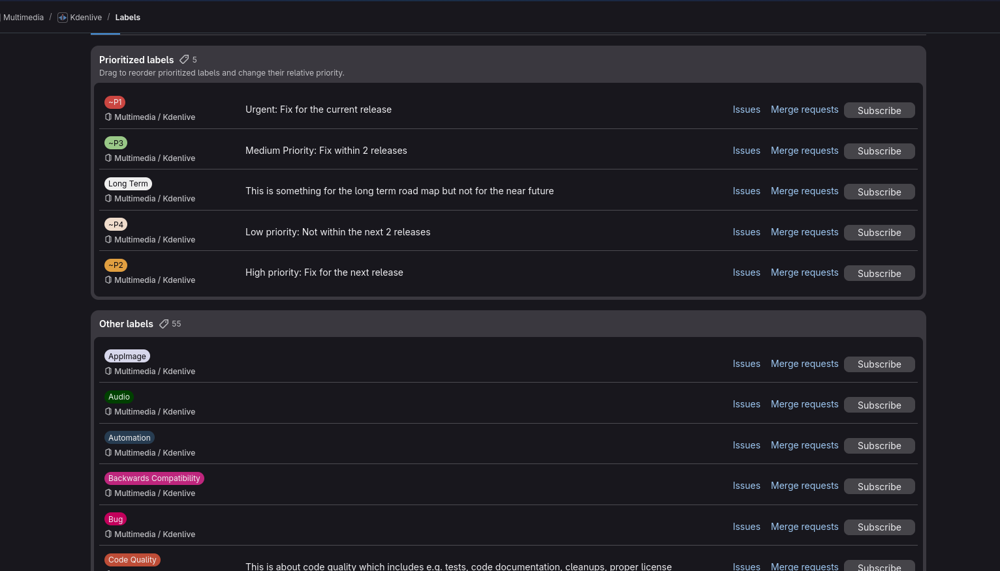

# Diário de Bordo – Lucas

**Disciplina:** GERÊNCIA DE CONFIGURAÇÃO E EVOLUÇÃO DE SOFTWARE  
**Equipe:** GCES 2026.1 – Kdenlive  
**Comunidade/Projeto de Software Livre:** [Kdenlive](https://invent.kde.org/multimedia/kdenlive)  
**Sprint:** Sprint 0 (07/04/2026 – 21/04/2026)  
**Matrícula:** 231035464   
**GitHub:** [@lucasarruda](https://github.com/lucasarruda9)  
**KDE Invent:** [@lucasma](https://invent.kde.org/lucasma)

---

## 1. Resumo da Sprint 0 (07/04/2026 - 21/04/2026)

Nesta sprint, o foco principal foi o estabelecimento do ambiente de desenvolvimento e a imersão na cultura e processos da comunidade KDE. O Kdenlive é um editor de vídeo gratuito e open source, desenvolvido principalmente em **C++**, que utiliza o **MLT Framework** como motor central de processamento multimídia responsável por decodificação, transições e renderização. Além de utilizar bibliotecas como **frei0r** para efeitos de vídeo e **LADSPA** para áudio.

### 1.1 Arquitetura do Sistema
O projeto possui uma separação entre:
- **Interface Gráfica:** Construída com Qt e KDE Frameworks.
- **Motor de Processamento:** MLT Framework

### 1.2 Ambiente de Desenvolvimento (Build)
Tentei realizar o build inicialmente no Ubuntu 22.04, mas a versão era inferior à exigida para as dependências atuais (Ubuntu 25.10). Explorei o Craft e o KDE-Builder, mas ambos apresentaram falhas críticas de configuração. No caso do Craft, o processo era interrompido por um erro 404 ao tentar acessar o repositório do plugin bigSh0t; mesmo corrigindo manualmente o link para o repositório oficial, a ferramenta falhava ao tentar buscar a branch master, que havia sido renomeada para main no novo destino. Já o KDE-Builder falhou devido a conflitos de versão no sistema base. A solução definitiva foi subir um container Ubuntu Rolling (25.04) via Docker, onde instalei manualmente todas as dependências de Qt6, KF6 e MLT necessárias para a compilação.



*Figura 1: Tela do Kdenlive após Build correta.*


*Figura 2: Tela de edição do Kdelive.*

**Comando de execução com display via Docker:**
```bash
xhost +local:docker
docker run -it --net=host --env="DISPLAY=$DISPLAY" -v /tmp/.X11-unix:/tmp/.X11-unix kdenlive-definitivo dbus-run-session kdenlive
```

### 1.3 Contato com Devs e Comunidade:

Descobri que a KDE possui uma comunidade ativa. Os principais canais de contato entre desenvolvedores são pelo:
- Aplicativo "Matrix", mais especificamente a Sala "#kde-devel:kde.org".
- Fórum da KDE Discuss.
- kde-devel.

### 1.4 Padrão de Branches e Versionamento

A comunidade do Kdenlive segue um modelo de versionamento baseado em três tipos principais de branches:

- **master**: Versão de desenvolvimento mais recente do Kdenlive.
- **release/**: usadas para preparar versões de lançamento. Elas são criadas a partir da master quando o projeto entra em fase de estabilização.
- **work/**: Branches de trabalho utilizadas para desenvolvimento de novas funcionalidades. Mudanças são feitas nessas branches antes de serem submetidas via Merge Request para revisão e eventual integração no master.

---

### 1.5 Contribuição

Para contribuir, o desenvolvedor deve configurar seu usuário Git local e criar uma conta no KDE Invent (GitLab). Sem essa conta, não é possível interagir plenamente com os repositórios. O projeto utiliza issues como principal forma de rastreamento e orientação de tarefas.

O fluxo de contribuição para desenvolvedores externos segue o modelo de fork:

- O repositório é copiado, por meio do fork, para a conta pessoal do desenvolvedor
- As alterações são feitas localmente
- Um Merge Request (MR) é enviado para o repositório principal

Após o envio, o código passa por revisão da comunidade antes de ser aceito e integrado à branch master.

As mensagens de commit devem seguir padrões consistentes:

- Título descritivo em formato imperativo (ex: "Fix button disappearing...")
- Corpo explicando claramente o motivo da mudança, de forma direta e objetiva
- Uso da tag `BUG: [número]` quando a alteração corrige um problema reportado

Além disso, o código submetido deve seguir práticas de qualidade do projeto:

- **Estilo de código**: deve seguir o padrão já existente no projeto
- **Testes automatizados**: mudanças em lógica crítica devem incluir ou atualizar testes unitários
- **Documentação**: partes complexas ou pouco claras do código devem ser comentadas para facilitar manutenção

### 1.6 Labels

O sistema de issues do Kdenlive utiliza labels para organizar e priorizar tarefas de desenvolvimento.


#### Labels de prioridade

Essas labels definem a urgência e o planejamento de correção ou implementação:

- **~P1 (Urgent)**: prioridade máxima, usada para problemas críticos como crashes ou perda de dados na versão atual.
- **~P2 (High Priority)**: alta prioridade, geralmente resolvida até o próximo lançamento.
- **~P3 (Medium Priority)**: prioridade média, planejada para versões futuras próximas.
- **~P4 (Low Priority)**: baixa prioridade, usada para melhorias menores ou não urgentes.
- **Long Term**: itens de longo prazo, ligados ao roadmap futuro do projeto.

---

# Outras labels

O projeto possui aproximadamente 55 labels adicionais usadas para categorizar o tipo de issue ou área afetada. Como por exemplo:

- **Code Quality**: relacionada à qualidade interna do código, incluindo testes automatizados, documentação, refatoração, limpeza de código e modernização de partes obsoletas.
- **Feature Request**: usada para solicitações de novas funcionalidades no software.
- **First Task**: identifica issues simples e introdutórias, voltadas para novos contribuidores que estão começando no projeto.

E dentre muitas outras. Essas labels ajudam a organizar o desenvolvimento do Kdenlive, facilitando a triagem, priorização e distribuição das tarefas dentro da comunidade.


*Figura 3: Tela de labels*

## 2. Atividades Realizadas

| Data       | Atividade                                     | Tipo         | Referência                                                                                                                                                                                         | Status    |
| ---------- | --------------------------------------------- | ------------ | -------------------------------------------------------------------------------------------------------------------------------------------------------------------------------------------------- | --------- |
| 10/04/2026 | Estudo da arquitetura do Kdenlive             | Estudo       | [Link](https://invent.kde.org/lucasma/kdenlive/-/blob/master/dev-docs/architecture.md)                                                                                                             | Concluído |
| 11/04/2026 | Criação de conta no Invent.kde                | Outro        | [Link](https://invent.kde.org/lucasma)                                                                                                                                                             | Concluído |
| 13/04/2026 | Criação do Fork do repositório                | Código       | [Link](https://invent.kde.org/lucasma/kdenlive)                                                                                                                                                    | Concluído |
| 14/04/2026 | Mapeamento de canais de comunicação e devs    | Estudo       | [Link](https://develop.kde.org/docs/getting-started/building/help-developers/)                                                                                                                     | Concluído |
| 16/04/2026 | Estudo do Guia de Contribuição e Build        | Estudo       | [Link contribuição](https://develop.kde.org/docs/getting-started/building/help-developers/) [Link Buld](https://invent.kde.org/multimedia/kdenlive/-/blob/master/dev-docs/build.md?ref_type=heads) | Concluído |
| 21/04/2026 | Compilação e execução bem-sucedida via Docker | Código       | [Link build](https://invent.kde.org/multimedia/kdenlive/-/blob/master/dev-docs/build.md?ref_type=heads)                                                                                            | Concluído |
| 21/04/2026 | Documentação do Diário de Bordo Sprint 0      | Documentação | [repositorio](https://github.com/caeslucio/GCES-Kdenlive-relatorios/blob/main/docs/materiais/template-relatorio.md)                                                                                | Concluído |

---

## 3. Maiores Avanços

- **Consolidação do Ambiente via Docker** Superação da incompatibilidade de Sistema Operacional através da criação de uma imagem Ubuntu Rolling (25.04), permitindo a compilação completa do MLT Framework e Kdenlive com suporte à GUI via socket X11.

- **Mapeamento de Governança e Fluxo:** Identificação dos padrões de contribuição da comunidade KDE, incluindo nomenclatura de branches, etiquetas de prioridade e canais oficiais de comunicação.

---

## 4. Maiores Dificuldades

- **Build do Projeto:** As dificuldades de build impactaram significativamente o ambiente de desenvolvimento, principalmente devido à incompatibilidade de versões e falhas em ferramentas de automação como Craft e KDE-Builder para Ubuntu 22.04. Isso exigiu a migração para um ambiente containerizado via Docker.


*Figura 4: Tela de Link quebrado pro repositório do bigSh0t.*


*Figura 5: Tela de Link correto para bigSh0t.*


*Figura 6: Tela de Falha do Craft em achar Master.*

- **Adaptação ao Ecossistema KDE Invent:** Também houve dificuldade na adaptação ao fluxo de trabalho específico da comunidade KDE. Como o GitLab não é uma ferramenta que utilizo com frequência, o processo de configuração da KDE Identity, compreensão da interface do KDE Invent e execução correta do fork do projeto exigiu atenção adicional. Além disso, o entendimento do fluxo de contribuição foi um desafio inicial, pois foi necessário compreender como o fork interage com os repositórios remotos locais para garantir que as alterações sejam enviadas corretamente por meio de Merge Request, respeitando as políticas de revisão e integridade exigidas pela comunidade.

---

## 5. Aprendizados

- **Fluxo e Versionamento:** Entendi a dinâmica de releases quadrimestrais e o uso de branches como "master", "release/*" e "work/*", além do papel de cada uma no desenvolvimento.

- **Ambiente de Build e Dependências:** Compreendi na prática a complexidade de builds em projetos grandes como o Kdenlive, especialmente a forte dependência entre múltiplas bibliotecas do ecossistema KDE.

- **Uso de Containers:** Aprimorei o uso do Docker como solução de isolamento de ambiente, permitindo contornar limitações do sistema operacional local e garantir um ambiente reproduzível para desenvolvimento.

- **Canais de Suporte:** Localizei e entendi o uso dos canais oficiais da comunidade KDE, como Matrix e listas de discussão, como principais meios de comunicação entre desenvolvedores.

---

## 6. Plano Pessoal para a Próxima Sprint

* [ ] Abrir um Merge Request (MR) no repositório oficial ou da equipe.
* [ ] Escrever o diário de bordo referente à Sprint 1.
* [ ] Ajudar na documentação geral do repositório do grupo.

---


## 7. Histórico de Versões

| Versão | Descrição                               | Autor(es)                                          | Data       |
| ------ | --------------------------------------- | -------------------------------------------------- | ---------- |
| 1.1    | Adicionando Documentação da Sprint0     | [Lucas Mendonça ](https://github.com/lucasarruda9) | 21/04/2026 |
| 1.2    | Correção das links de imagem da Sprint0 | [Caetano Santos](https://github.com/caeslucio)     | 11/05/2026 |