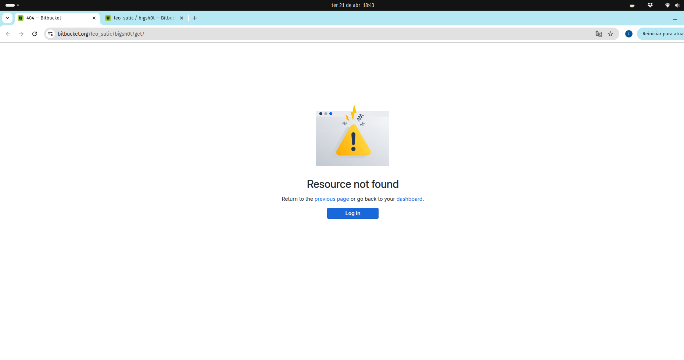
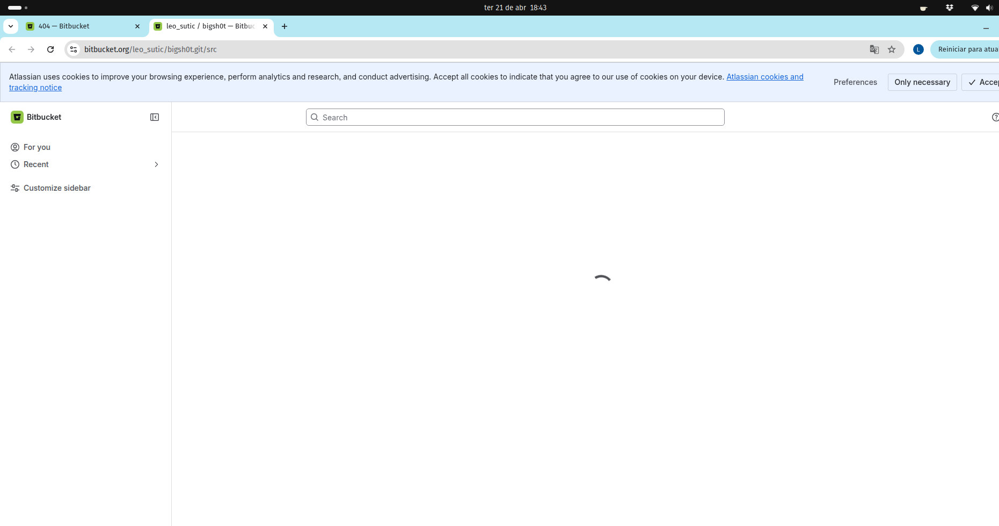
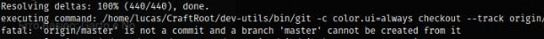

# Diário de Bordo – Lucas

**Disciplina:** GERÊNCIA DE CONFIGURAÇÃO E EVOLUÇÃO DE SOFTWARE  
**Equipe:** GCES 2026.1 – Kdenlive  
**Comunidade/Projeto de Software Livre:** [Kdenlive](https://invent.kde.org/multimedia/kdenlive)  
**Sprint:** Sprint 1 (22/04/2026 – 11/05/2026)  
**Matrícula:** 231035464   
**GitHub:** [@lucasarruda](https://github.com/lucasarruda9)  
**KDE Invent:** [@lucasma](https://invent.kde.org/lucasma)

---

## 1. Resumo da Sprint 1 (22/04/2026 - 11/05/2026)

Esta Sprint foi focada exclusivamente na contribuição para o projeto de código aberto Kdenlive. O trabalho envolveu desde a análise de tarefas adequadas para novos contribuidores até a submissão de código oficial para a base principal do software a partir de um Merge Request.

### 1.1 Identificação de Issue

O processo iniciou-se com o mapeamento de Issues no GitLab do projeto, utilizando o filtro "First Task". O objetivo foi selecionar uma demanda que fosse acessível para um novo contribuidor, mas que oferecesse um desafio técnico suficiente para compreender a arquitetura do Kdenlive na prática. Dessa forma, foi escolhida a Issue #2172 por ser uma demanda recente, permitindo com que o problema ainda estivesse presente na versão atual da master e minimizou o risco de conflitos de código gerados por commits simultâneos da comunidade. 

### 1.2 Descrição da Issue

A Issue solicitava uma melhoria na organização lógica do projeto no Kdenlive. No Kdenlive, existe uma pasta específica destinada exclusivamente a Sequências, que representam timelines aninhadas dentro do projeto. O problema identificado era que o sistema permitia que o usuário importasse ou arrastasse qualquer tipo de mídia, como vídeos, áudios ou imagens, para dentro dessa pasta. Isso causava inconsistência na organização do projeto, uma vez que a pasta de “Sequências” deveria ser restrita apenas a elementos do tipo sequência, utilizados para estruturar diferentes timelines do projeto.

### 1.3 Contribuição

Como a issue não detalhava os cenários de validação, mapeei as rotas de interação para garantir que a regra de organização fosse aplicada em todos os casos. Minha contribuição consistiu em:

* **Alteração em slotAddClip()`**:
    * **O que foi feito**: Implementei uma validação no fluxo de criação e importação de novos clipes para verificar o diretório de destino.
    * **Resultado**: O código agora verifica se o ID da pasta de destino corresponde à pasta de "Sequências". Caso o clipe que está a ser criado não seja uma sequência, o destino é forçado para a raiz do projeto, impedindo que mídias brutas sejam importadas diretamente para o diretório restrito.

* **Alteração em dropMimeData()**:
    * **O que foi feito**: Adicionei validação no fluxo de drag-and-drop de itens dentro do bin.
    * **Resultado**: Ao perceber a movimentação de um clipe comum para a pasta de Sequências, o editor de vídeo redireciona automaticamente o item para o diretório principal do bin, garantindo que a organização se mantenha mesmo após a importação inicial.

* **Feedback de Interface**:
    * **O que foi feito**: Integrei notificações de sistema utilizando a biblioteca de internacionalização do KDE para tratar diferentes cenários de interação.
    * **Resultado**: Implementei dois níveis de feedback: 
        1. Um aviso de erro para quando o usuário tenta mover manualmente um clipe inválido para a pasta de Sequências.
        2. Uma mensagem informativa que explica o redirecionamento automático para a raiz quando um clipe é importado na pasta de Sequências.

### 1.4 Merge Request

A etapa final consistiu na submissão das alterações para o repositório oficial do Kdenlive via GitLab. O processo de Merge Request envolveu:

O MR passou pelas seguintes etapas:

* **Documentação da solução:** descrição técnica das alterações realizadas nas funções `slotAddClip` e `dropMimeData`, explicando o novo comportamento do sistema e facilitando o processo de revisão pelos mantenedores. Também foi incluído um vídeo demonstrando o comportamento após as modificações.

* **Integração com a issue:** o Merge Request foi vinculado à Issue #2172, permitindo o rastreamento automático da resolução dentro do GitLab do KDE.

## 2. Atividades Realizadas

| Data  | Atividade                                   | Tipo | Referência | Status    |
| ----- | ------------------------------------------- | --------------------------------- | --------------- | --------- |
| 05/05/2026 | Identificar possíveis issues a trabalhar com a label "First task" | Estudo | [Link]() | Concluído |
| 06/05/2026 | Seleção da issue #2172 | Outro | [Link]() | Concluído |
| 07/05/2026 | Compreender o escopo do código a ser trabalhado na issue | Código | [Link]() | Concluído |
| 09/05/2026 | Implementar funcionalidades para atender a issue | Código | [Link]() | Concluído |
| 09/05/2026 | Abrir Merge request para aprovação na master do kdenlive | Documentação | [Link]() | Concluído |
| 09/05/2026 | Criar Documentação de contribuição individual da Sprint 1 | Documentação | [Link]()| Concluído |
| 10/05/2026 | Refatorar código para adequar aos quesitos do Kdenlive | Código | [Link]()| Concluído |

---

## 3. Maiores Avanços

- **Compreensão de Pipelines** Entendimento prático de como funciona o fluxo de integração contínua do Kdenlive, tanto para Push no repositório forkado quanto no Merge request.

- **Colaboração Direta com Código:** Transição da análise para a prática através da resolução da Issue #2172. O progresso foi marcado pelo rastreamento de lógica do código, para localizar as classes Bin e ProjectClip, implementando validações que corrigem a usabilidade do software.

- **Maior compreendimento da linguagem C++:** (complete ...)
---

## 4. Maiores Dificuldades

- **Navegação em Codebase de Grande Escala:** O Kdenlive possui uma base de código extensa, com diversos arquivos que passam de mil linhas. A maior dificuldade inicial foi rastrear o fluxo de execução entre diferentes componentes para localizar as funções corretas a serem modificadas. Além disso, parte da lógica relevante estava distribuída em arquivos distintos, exigindo análise cruzada do código para compreender o fluxo completo. Embora o Doxygen ajude a mapear a arquitetura do projeto, a maior dificuldade ainda foi compreender o fluxo lógico e as dependências entre as funções na prática.

- **Ambiguidade na Definição da Issue:** A Issue #2172 apresentava apenas uma descrição sucinta do objetivo desejado, sem um checklist técnico ou passos definidos para a validação. Isso exigiu uma fase inicial de análise para definir quais cenários de teste seriam necessários (importação via botão, drag-and-drop interno e externo, e soltura sobre diferentes tipos de itens) para garantir que a implementação fosse robusta e cobrisse todos os casos de uso possíveis sem especificações prévias, incluindo funcionalidades e interfaces a serem implementadas.

- **Manipulação de ponteiros inteligentes:** 

*Figura 4: Tela de Link quebrado pro repositório do bigSh0t.*

*Figura 5: Tela de Link correto para bigSh0t.*

*Figura 6: Tela de Falha do Craft em achar Master.*

- **Adaptação ao Ecossistema KDE Invent:** Também houve dificuldade na adaptação ao fluxo de trabalho específico da comunidade KDE. Como o GitLab não é uma ferramenta que utilizo com frequência, o processo de configuração da KDE Identity, compreensão da interface do KDE Invent e execução correta do fork do projeto exigiu atenção adicional. Além disso, o entendimento do fluxo de contribuição foi um desafio inicial, pois foi necessário compreender como o fork interage com os repositórios remotos locais para garantir que as alterações sejam enviadas corretamente por meio de Merge Request, respeitando as políticas de revisão e integridade exigidas pela comunidade.

## 5. Histórico de Versões

| Versão | Descrição                                                      | Autor(es)                            | Data       | 
|--------|----------------------------------------------------------------|--------------------------------------|------------|
| 1.1    |  Adicionando Tabela de atividades realizadas  e avanços na Documentação da Sprint1               |  [Lucas Mendonça](https://github.com/lucasarruda9)  | 09/05/2026 | 
| 1.2    |  Adicionando seção de maiores dificuldades              |  [Lucas Mendonça](https://github.com/lucasarruda9)  | 10/05/2026 | 