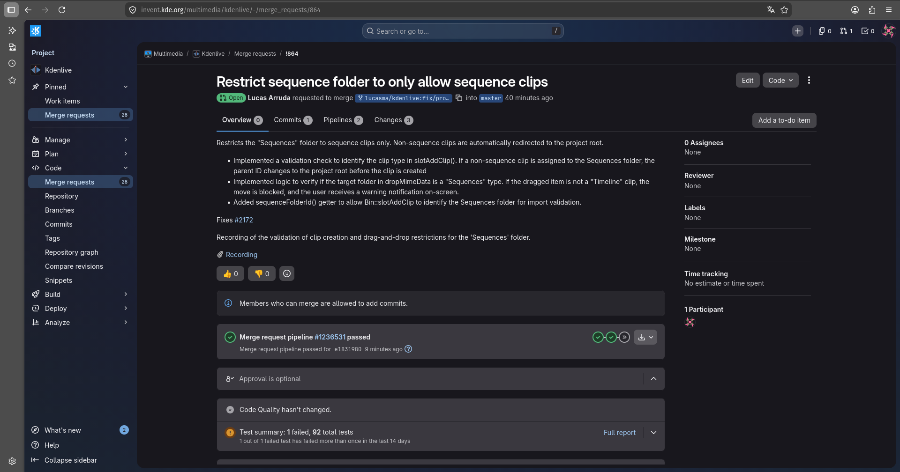

# Diário de Bordo – Lucas

**Disciplina:** GERÊNCIA DE CONFIGURAÇÃO E EVOLUÇÃO DE SOFTWARE  
**Equipe:** GCES 2026.1 – Kdenlive  
**Comunidade/Projeto de Software Livre:** [Kdenlive](https://invent.kde.org/multimedia/kdenlive)  
**Sprint:** Sprint 2 (12/05/2026 – 25/05/2026)  
**Matrícula:** 231035464   
**GitHub:** [@lucasarruda](https://github.com/lucasarruda9)  
**KDE Invent:** [@lucasma](https://invent.kde.org/lucasma)

---

## 1. Resumo da Sprint 2 (12/05/2026 - 25/05/2026)

A Sprint 2 foi focada exclusivamente na contribuição para o projeto de código aberto Kdenlive. O trabalho envolveu desde a triagem de tarefas voltadas para novos contribuidores nas plataformas do KDE até a implementação de código e submissão de um Merge Request para a base principal do software. A atividade prática consistiu em resolver uma demanda de usabilidade aberta desde 2019, aplicando lógica em QML para permitir o arrasto de marcadores de clipe na linha de tempo sem interferir nas interações de clique já existentes.

### 1.1 Identificação do Bug

O processo iniciou-se com o mapeamento de relatórios de falhas no ecossistema Bugs.kde.org, utilizando o filtro de buscas voltado a "junior-jobs" do Kdenlive. O objetivo foi selecionar uma demanda de usabilidade reportada diretamente pela comunidade que trouxesse um desafio sob medida para novos contribuidores. Dessa forma, foi selecionado o BUG 406887, uma pendência aberta desde 2019.

*Figura 1: Lista de Bugs do KDE com os filtros "junior-jobs" e "kdenlive"*

### 1.2 Descrição do Bug

O BUG 406887 apontava uma limitação na usabilidade do timeline do Kdenlive, sendo impossível mover marcadores de clipe diretamente arrastando-os com o mouse. No comportamento original, para alterar a posição de um marcador, o usuário era obrigado a abrir um menu de edição e digitar o novo valor de tempo manualmente. A proposta consistia em permitir a movimentação do marcador na timeline pelo mouse.

*Figura 2: BUG 406887*

### 1.3 Contribuição

Como a alteração mexia direto com a parte visual e com a captura dos movimentos do usuário, o desenvolvimento concentrou-se nos arquivos de interface em QML. A contribuição estruturou-se em:

* **Implementação de Arrastabilidade em MouseArea**:
    * **O que foi feito**: Ativação e configuração das propriedades de arrasto nativas do framework através dos parâmetros drag.target e drag.axis
    * **Resultado**: O componente do marcador passou a responder ao deslocamento do mouse exclusivamente no eixo horizontal  da linha de tempo.

* **Tratamento dos Cliques e do Arrasto**:
    * **O que foi feito**: Criação de travas lógicas simples para registrar a coordenada inicial no momento do clique (onPressed) e compará-la na hora em que o usuário solta o botão (onReleased).
    * **Resultado**: Utilizando o arredondamento de pixels com Math.round(), o sistema aprendeu a diferenciar pequenos tremores ou cliques estáticos de um arrasto real.

* **Sincronização com o Motor em C++**:
    * **O que foi feito**: Integração dos desclocamentos calculados na tela para transformá-los em frames de vídeo reais, respeitando a escala de tempo e a velocidade do clipe.
    * **Resultado**: Ao final do movimento, o código avisa a função moveMarker(), salvando a nova posição do marcador nos dados do projeto e atualizando a interface.

A seguir, o vídeo demonstrando o comportamento do Editor Kdenlive após a implementação da nova funcionalidade:

  <iframe width="560" height="315" src="https://www.youtube.com/embed/TewyznjV4gM" frameborder="0" allow="accelerometer; autoplay; clipboard-write; encrypted-media; gyroscope; picture-in-picture" allowfullscreen></iframe>

  <small> <i>Ou assista pelo link: <a href="https://youtu.be/TewyznjV4gM" target="_blank">YouTube</a>.</i></small>

### 1.4 Merge Request

A etapa final consistiu na submissão das alterações para o repositório oficial do Kdenlive via GitLab. O processo de Merge Request envolveu:

* **Documentação da solução:** Escrita de uma mensagem de commit direta e focada no resultado prático, explicando como o arrasto foi adicionado e como os cliques foram protegidos, facilitando a revisão por parte dos mantenedores do Kdenlive.

* **Vínculo automatizado:** Inclusão da tag BUG: 406887 no commit, o que garante o rastreamento correto e o fechamento automático do relatório de falhas lá no Bugzilla do KDE assim que o código for aceito na branch principal.

*Figura 3: Merge Request da contribuição*

---

## 3. Maiores Avanços

- **Maior domínio do FrameWork de Interface QML:** A adição dessa nova funcionalidade exigiu a manipulação direta do ciclo de vida de eventos de toque e mouse dentro de uma MouseArea. Foi necessário controlar propriedades de arrasto dinâmico através de arquivos QML e lógica integrada, interpretando as coordenadas de movimentação na tela.

- **Resolução de concorrência de eventos:** O principal desafio técnico envolveu mediar o conflito entre três ações distintas no mesmo componente: o clique simples (que reposiciona a agulha da linha de tempo), o clique duplo (que abre o editor de marcadores) e o arrasto fluido. A solução estabeleceu travas lógicas baseadas na diferença entre a coordenada inicial e a final, utilizando o arredondamento de pixels para diferençar movimentos sem querer de arrastos voluntários.

- **Integração com o ecossistema e rastreamento de bugs:** O processo permitiu compreender o fluxo de contribuição de softwares de grande porte, desde a análise de relatórios de falhas abertos pela comunidade no Bugzilla do KDE até o mapeamento do comportamento relatado na issue oficial (BUG: 406887). Isso resultou na capacidade de identificar a causa raiz de demandas reais de usabilidade e documentar a solução diretamente no ciclo de desenvolvimento do projeto.

---

## 4. Maiores Dificuldades

- **Concorrência de Cliques na Interface:** A maior dificuldade foi lidar com os eventos do mouse. O mesmo componente precisava aceitar três ações diferentes: um clique rápido para mover a agulha, um clique duplo para abrir propriedades e o arrasto para mover o marcador. Fazer o QML entender a diferença entre um tremor milimétrico do mouse e um arrasto intencional exigiu muita tentativa e erro na lógica de travas.

- **Falta de detalhamento da nova Feature:** O relatório de falhas original de 2019 indicava apenas a falta de arrasto dos marcadores de clip usando mouse, mas não detalhava as restrições técnicas. O desafio foi descobrir sozinho que o movimento do marcador na tela precisava ser convertido matematicamente para a escala de tempo e velocidade do clipe antes de enviar o dado para o C++, para evitar que o marcador ficasse desalinhado na timeline.

---

## 5. Aprendizados

- **Manipulação de Coordenadas e Pixels:** Aprendizado prático de como capturar dados brutos de movimento do mouse (MouseArea, drag.target) e tratá-los via código.

- **Integração de Tecnologias:** Compreensão de como o framework do Qt une o design visual do QML com funções em JavaScript para resolver problemas de lógica de interface

- **Resolução de Bugs via Relatórios da Comunidade:** Entendimento real de como navegar Bugs.kde.org, interpretar o que os usuários estão reclamando e usar essas informações para caçar o problema direto no código, fechando o ciclo com a automação de tags no commit (BUG: 406887).

---

## 7. Histórico de Versões

| Versão | Descrição                                                      | Autor(es)                            | Data       | 
|--------|----------------------------------------------------------------|--------------------------------------|------------|
| 1.0    |  Adicionando template e resumo introdutório da Sprint2                |  [Lucas Mendonça](https://github.com/lucasarruda9)  | 24/05/2026 | 
| 1.1    |  Adicionando Identificação e descrição da nova funcionalidade (BUG 406887)               |  [Lucas Mendonça](https://github.com/lucasarruda9)  | 24/05/2026 | 
| 1.2    |  Adicionando documentação da contribuição, maiores dificuldades, avanços e aprendizados               |  [Lucas Mendonça](https://github.com/lucasarruda9)  | 24/05/2026 | 
