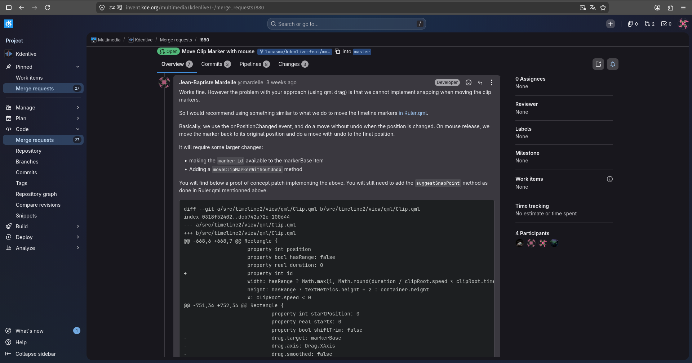
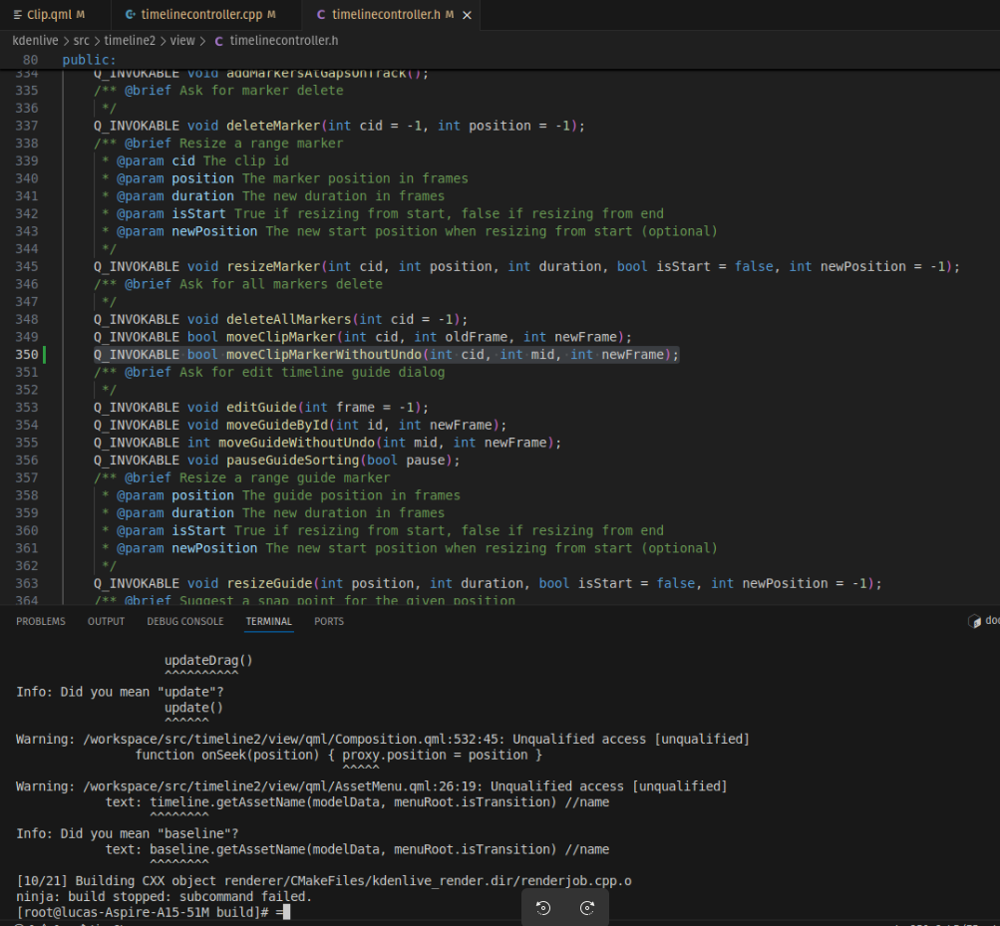
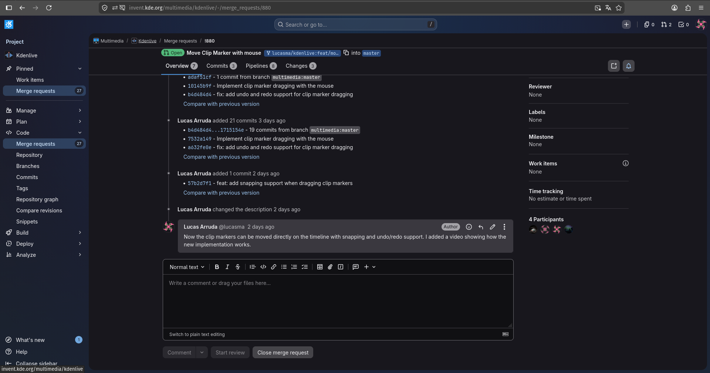

# Diário de Bordo – Lucas

**Disciplina:** GERÊNCIA DE CONFIGURAÇÃO E EVOLUÇÃO DE SOFTWARE  
**Equipe:** GCES 2026.1 – Kdenlive  
**Comunidade/Projeto de Software Livre:** [Kdenlive](https://invent.kde.org/multimedia/kdenlive)  
**Sprint:** Sprint 4 (09/06/2026 – 30/06/2026)  
**Matrícula:** 231035464   
**GitHub:** [@lucasarruda](https://github.com/lucasarruda9)  
**KDE Invent:** [@lucasma](https://invent.kde.org/lucasma)

---

## 1. Resumo da Sprint 4 (09/06/2026 - 30/06/2026)

O foco da Sprint 4 foi a evolução e o refinamento do Merge Request para o Kdenlive (**BUG 406887**). Após a implementação do arrasto básico dos marcadores (Sprint 2) e do sistema de Undo/Redo (Sprint 3), esta sprint concentrou-se em reestruturar a abordagem técnica para atender às últimas exigências arquiteturais feitas pelos mantenedores. Esse processo de ajuste foi basicamente a etapa final de validação do código, preparando a contribuição para aprovação e integração definitiva na branch `master` do repositório principal.

### 1.1 Acompanhamento e Feedback do MR #880

Dando continuidade ao acompanhamento do Merge Request #880, o mantenedor Jean forneceu um feedback a respeito das limitações da abordagem anterior. Embora o sistema de Undo/Redo desenvolvido na Sprint 3 estivesse funcionando bem, ele pontuou que o uso do arrasto nativo do QML (`Drag`) impedia a implementação correta da mecânica de *snapping*, que é a atração magnética aos pontos de referência da Timeline.

Para solucionar o problema, Jean propôs uma mudança de arquitetura inspirada no funcionamento dos marcadores da régua principal (`Ruler.qml`), fornecendo uma prova de conceito em formato de patch. A orientação consistia em trocar o componente de arrasto por manipulação manual de coordenadas e dividir o movimento do marcador em duas etapas no backend para não entupir a pilha de histórico do usuário.

*Figura 1: Discussão técnica com os mantenedores do Kdenlive*

### 1.2 Resolução de Conflitos e Ajustes no Linter

Durante a integração do patch e testes no pipeline de Integração Contínua (CI) do GitLab, a build falhou devido a restrições estritas do linter de QML do projeto (`all_qmllint`). O validador acusou problemas de "Unqualified access" no arquivo `Clip.qml`, identificando trechos de código legados anteriores à alteração que passaram a ser validados pelo escopo do linter devido à nova edição. Esse comportamento gerava um erro fatal na pipeline e travava a compilação local, impedindo os testes da nova funcionalidade.

*Figura 2: Erro de Build por conta do qmllint*

Para mitigar o problema e destravar o fluxo de desenvolvimento em ambiente local, foi necessário remover temporariamente a dependência `add_dependencies(kdenlive all_qmllint)` na linha 369 do arquivo `CMakeLists.txt` (localizado no diretório `src`). Essa alteração foi mantida estritamente fora dos commits para não modificar as regras globais do projeto. Por fim, para garantir a conformidade com a esteira do GitLab, o escopo das variáveis foi devidamente qualificado e ajustado dentro das frentes de trabalho afetadas no arquivo QML, resolvendo os avisos e liberando o pipeline.

### 1.3 Descrição da Nova Demanda (Evolução Técnica)

O feedback do mantenedor indicou que a abordagem baseada em Drag não permitiria implementar corretamente o snapping. Por isso, a solução foi substituir esse mecanismo por um controle manual dos eventos de mouse.

* **Gerenciamento de Eventos Visuais (`WithoutUndo`):** Implementar e invocar o método `moveClipMarkerWithoutUndo` no C++ para atualizar a posição visual do marcador dinamicamente no evento `onPositionChanged` do QML.
* **Transação Definitiva (`moveClipMarker`):** No evento `onReleased`, restaurar temporariamente o marcador à posição original do clique e aplicar o movimento definitivo associado à pilha de Undo/Redo do `pCore`, garantindo que apenas o movimento final fosse registrado na pilha de Undo/Redo, preservando o comportamento esperado do Ctrl+Z.
* **Mecânica de Snapping:** Integrar a função de cálculo de quadros (`suggestSnapPoint`) para que o marcador seja atraído magneticamente pelos cortes e referências da timeline ao ser arrastado.

### 1.4 Contribuição

As principais alterações implementadas foram:

* **Backend:** Criação e declaração do método `moveClipMarkerWithoutUndo` na classe `TimelineController`, tratando travas de concorrência com `QMutexLocker`, validação de limites com `qBound` e acesso direto ao modelo de dados do clipe binário (`markerModel->moveMarker`).
* **Frontend com QML** Refatoração do bloco `markerComponent` no arquivo `Clip.qml`. Foi implementado  o mapeamento de coordenadas com `mapToItem`, o cálculo de deltas em frames proporcionais ao zoom/velocidade da linha de tempo e as lógicas de disparo sequencial nos estados `onPressed`, `onPositionChanged` e `onReleased`.

### 1.5 Atualização do Merge Request

As modificações de refatoração estrutural foram commitadas atualizando o merge request. O histórico manteve-se indexado à issue original (`BUG: 406887`) para fins de rastreabilidade de código e evolução de software.

*Figura 3: Histórico de modificações atualizado no Merge Request #880*

---

## 2. Atividades Realizadas

| Data  | Atividade | Tipo | Referência | Status    |
| ----- | --------- | ---- | ---------- | --------- |
| 10/06/2026 | Analisar a proposta de arquitetura de movimento enviada pelo mantenedor Jean | Estudo | [Link](https://invent.kde.org/multimedia/kdenlive/-/merge_requests/880) | Concluído |
| 15/06/2026 | Mapear o comportamento e funções de snapping implementadas no `Ruler.qml` | Estudo | [Link](https://invent.kde.org/lucasma/kdenlive/-/blob/feat/move-clip-marker-with-mouse/src/timeline2/view/qml/Ruler.qml?ref_type=heads) | Concluído |
| 21/06/2026 | Implementar o método C++ `moveClipMarkerWithoutUndo` no `TimelineController` | Código | [Link](https://invent.kde.org/lucasma/kdenlive/-/commit/57b2d7f1b55111616023834541ef6351d97f0f73) | Concluído |
| 22/06/2026 | Refatorar a captura de eventos de mouse e cálculo de deltas de frames no `Clip.qml` | Código | [Link](https://invent.kde.org/lucasma/kdenlive/-/commit/57b2d7f1b55111616023834541ef6351d97f0f73) | Concluído |
| 25/06/2026 | Integrar a mecânica de `suggestSnapPoint` ao fluxo de arrasto dos marcadores de clipe | Código | [Link](https://invent.kde.org/lucasma/kdenlive/-/commit/57b2d7f1b55111616023834541ef6351d97f0f73) | Concluído |
| 28/06/2026 | Commitar alterações para o Merge Request | Código | [Link](https://invent.kde.org/lucasma/kdenlive/-/commit/57b2d7f1b55111616023834541ef6351d97f0f73) | Concluído |
| 30/06/2026 | Documentar diário de bordo da Sprint 4 | Documentação | [Link](https://github.com/caeslucio/GCES-Kdenlive-relatorios) | Concluído |

---

## 3. Maiores Avanços

* **Cálculo de Snapping na Timeline:** Sucesso na implementação da mecânica para fazer o marcador alinhar-se ("grudar") aos pontos de referência da linha de tempo. Para isso, foi necessário converter a posição do mouse em pixels para quadros (frames) exatos do vídeo, considerando o nível de zoom atual e a taxa de FPS do projeto.

* **Resolução de Problemas com Linters Estritos:** Compreensão do funcionamento e depuração do `qmllint` da KDE, que bloqueava a compilação por conta de escopos de variáveis não qualificados (`Unqualified access`). A resolução desse problema trouxe maior domínio sobre como o projeto organiza e valida o escopo de seus componentes QML.

---

## 4. Maiores Dificuldades

* **Depuração do Linter de QML no Pipeline:** Entender o comportamento restritivo do `all_qmllint` adotado pelo time da KDE, que bloqueava a build devido a avisos de variáveis não qualificadas preexistentes no arquivo original.

---

## 5. Aprendizados

* **Limitações do Componente de Drag do QML:** Entendimento de que o arrasto nativo do QML  limita o controle sobre as coordenadas do mouse e impede o cálculo preciso do *snapping*. Ficou claro que o uso de eventos manuais como o(`onPositionChanged`) é a abordagem correta para integrar a lógica de atração magnética à linha de tempo.

* **Inconsistências em CI:** Percepção de que ferramentas de validação automatizada (`qmllint`) integradas recentemente ao projeto podem falhar ao validar o próprio código legado da branch `master`. Isso exigiu o aprendizado de estratégias para contornar temporariamente essas travas na build local (via `CMakeLists.txt`) para conseguir testar o desenvolvimento sem herdar falhas de builds ja existentes na master.

---

## 6. Histórico de Versões

| Versão | Descrição                                                      | Autor(es)                            | Data       | 
|--------|----------------------------------------------------------------|--------------------------------------|------------|
| 1.0    | Adiciona seção de resumo da sprint 4 | [Lucas Mendonça](https://github.com/lucasarruda9) | 30/06/2026 |
| 1.1    | Adiciona seção de atividades realizadas e maiores avanços | [Lucas Mendonça](https://github.com/lucasarruda9) | 30/06/2026 |
| 1.2    | Adiciona seção de maiores dificuldades e aprendizados | [Lucas Mendonça](https://github.com/lucasarruda9) | 30/06/2026 |
| 1.3    | Ajusta texto de seções do diario de bordo | [Lucas Mendonça](https://github.com/lucasarruda9) | 30/06/2026 |
| 1.4    | Adiciona imagens no diario de bordo | [Lucas Mendonça](https://github.com/lucasarruda9) | 30/06/2026 |